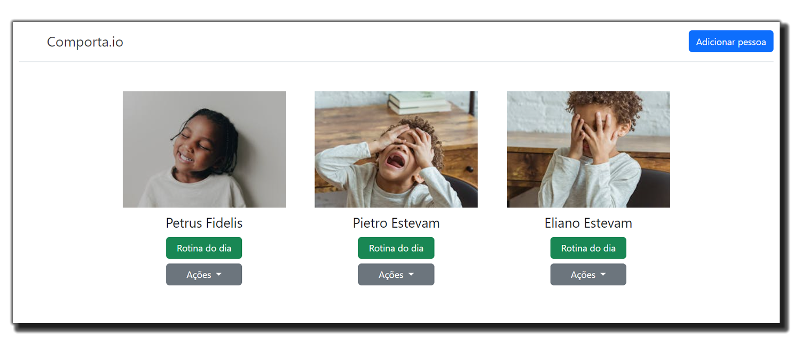

<p align="center" style="margin: 40px 0">
    Comporta.io
</p>

<div align="center">


</div>

# Comporta.io - Front-end

Camada front da aplicação.

**Comporta.io** tem como objetivo resolver a dor de pessoas que estão dentro do espectro autista nível 2 e 3. Essa dor está relacionada a identificação de possíveis mudanças de comportamentos.

Software foi desenvolvido para o MVP da Sprint: Arquitetura de Software da pós graduação de Engenharia de Software PUC-Rio.
Apresentação em: https://youtu.be/6cihGNLlNhE

> ⚠️ A aplicação consome as API's:
- [API Pessoa](https://github.com/elianoestevampuc/comportaio-api-pessoa.git)
- [API Rotina](https://github.com/elianoestevampuc/comportaio-api-rotina.git)
- [API Imagens](https://www.pexels.com/pt-br/api/)

## Pré-visualização

<p align="center" style="margin: 40px 0">
    
</p>

## Repositório github
https://github.com/elianoestevampuc/comportaio-frontend.git

## Dependência
Docker

## Executando a Aplicação


### 1 - Subir a aplicação
Para subir a aplicação, execute o seguinte comando:

```
docker-compose up
```
> ⚠️ A execução desse comando irá subir o frontend da aplicação como também as API's.

### 2 - Visualizar a Aplicação
Para visualiazar a aplicação, acesse a URL [http://localhost/comporta.io](http://localhost/comporta.io) no browser.

